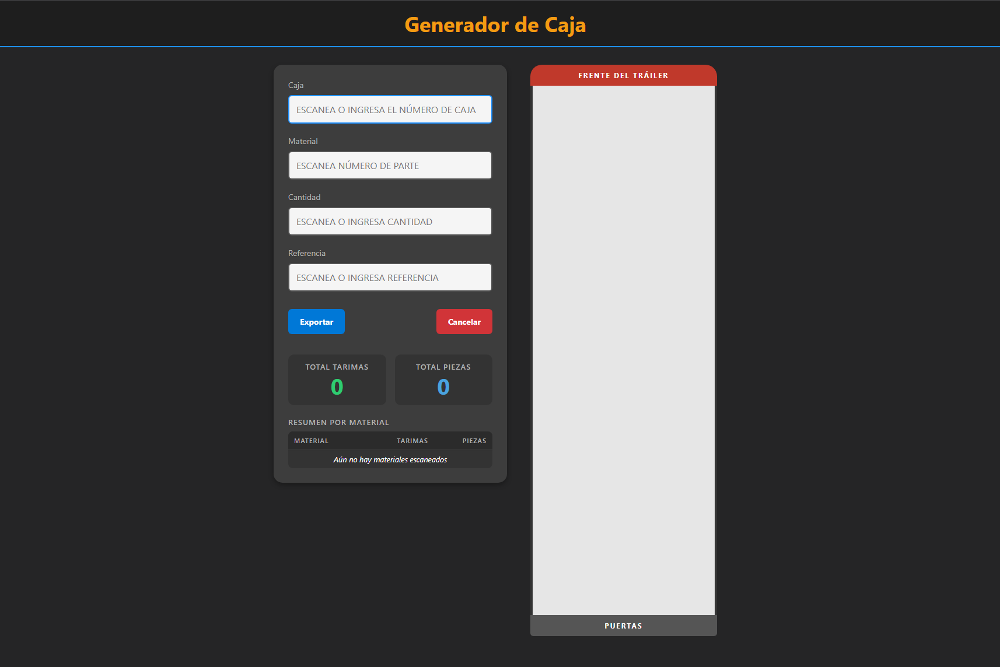
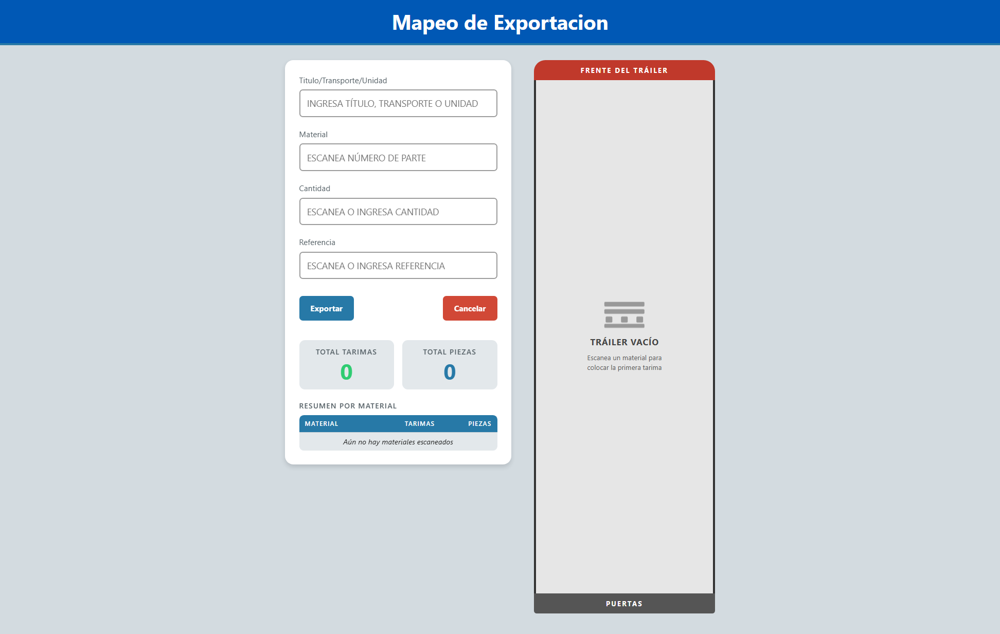

# Generador de Caja




Herramienta web para mapear la carga de un tráiler de exportación a **DSV**.

Permite registrar con lector de código de barras qué material va en cada tarima y en qué
posición del tráiler, y genera un archivo de Excel con el mapa de la caja, un resumen por
número de parte y el detalle tabular.

Sustituye el mapeo manual en papel o en hojas de cálculo hechas a mano.

---

## Características

- **Captura con escáner.** Todo el flujo se hace con el lector: cada Enter salta al
  siguiente campo y al cerrar el ciclo la tarima se dibuja sola.
- **Mapa visual del tráiler.** Rejilla de 14 filas × 2 columnas (28 posiciones), del
  frente hacia las puertas.
- **Varios materiales por tarima.** Una misma posición puede llevar más de un número de
  parte, cada uno con su cantidad y referencia.
- **No se pierde el avance.** Todo se guarda en el navegador conforme se escanea; si se
  refresca la página o se cierra por accidente, al volver a abrir sigue ahí.
- **Avisos que no interrumpen.** Los mensajes salen como notas que se cierran solas, sin
  cortar la captura. Sólo los borrados piden confirmación y detienen el trabajo.
- **Deshacer el borrado.** Si se pulsa *Cancelar* por error, hay unos segundos para
  recuperar todo el conteo.
- **Totales en vivo.** Total de tarimas, total de piezas y un resumen agrupado por número
  de parte para cotejar contra el packing list.
- **Avance de la caja a la vista.** Una barra en el encabezado se llena conforme avanza el
  tráiler y cambia de color en las últimas posiciones.
- **Modo claro y oscuro.** Con botón en el encabezado; recuerda la preferencia.
- **Funciona sin internet.** No hace ninguna petición a la red: la librería de Excel viaja
  dentro del propio repositorio.

---

## Cómo se usa

### Capturar

1. Escanea o escribe el **título, transporte o unidad** y presiona Enter.
2. Escanea el **material** (número de parte) → Enter.
3. Escanea o escribe la **cantidad** de piezas → Enter.
4. Escanea o escribe la **referencia** → Enter.

La tarima aparece en el mapa y el cursor regresa a *Material*, listo para la siguiente.
Abajo aparece un momento la confirmación de lo que quedó registrado —posición, material y
cantidad— para poder cazar un escaneo equivocado sin apartar la vista del lector.
Repite hasta terminar la caja.

> Los tres campos son obligatorios. Si algo falta o la cantidad es cero, avisa y deja el
> cursor en el campo que hay que corregir.

### Corregir una tarima

Al pasar el mouse sobre una tarima aparecen tres botones:

| Botón | Qué hace |
|:---:|---|
| **✎** | Abre todos los materiales de la tarima para modificarlos |
| **+** | Agrega otro material a esa tarima, sin tocar los que ya tiene |
| **×** | Elimina la tarima completa (pide confirmación y muestra qué se va a perder) |

Al eliminar una tarima intermedia, las siguientes se recorren y se renumeran solas para que
las posiciones queden siempre de 1 a N.

### Exportar

El botón **Exportar** descarga el archivo con el nombre:

```
{TÍTULO}-{MM}-{DD}-{AAAA}.xlsx
```

El botón **Cancelar** borra todo el progreso para empezar otra caja. Pide confirmación, y
después ofrece **Deshacer** durante unos segundos por si fue un clic accidental.

---

## El archivo de Excel

Se generan tres hojas:

### `Mapa_Visual`

Reproduce la rejilla del tráiler tal como se ve en pantalla, del frente a las puertas.
Cada celda ocupada muestra la posición y sus materiales:

```
[T-1] MAT-01 | 10 pcs  +  MAT-EXTRA | 5 pcs
```

Es la hoja para imprimir o para ubicar una tarima de un vistazo. No incluye la referencia,
a propósito, para que el mapa se mantenga legible.

### `Resumen`

Agrupado por número de parte, listo para cotejar contra el packing list:

| Número_Material | Tarimas | Total_Piezas |
|---|---|---|
| P-1 | 3 | 1450 |
| PACCAR | 1 | 25 |
| **TOTAL GENERAL** | **4** | **1475** |

### `Datos_ETL`

El detalle completo, **una fila por material**. Si una tarima lleva tres números de parte,
genera tres filas con el mismo número de tarima:

| Tarima | Número_Material | Cantidad_Piezas | Referencia |
|---|---|---|---|
| 1 | MAT-01 | 10 | REF-A1 |
| 1 | MAT-EXTRA | 5 | REF-C3 |
| 2 | MAT-02 | 20 | REF-B2 |

La columna `Tarima` es **numérica**, para que se pueda ordenar y filtrar correctamente en
Excel.

---

## Cómo ejecutarlo

No requiere instalación, compilación ni servidor.

### En línea

Publicado con GitHub Pages desde este mismo repositorio.

### En local

Descarga el repositorio y abre `index.html` con doble clic:

```bash
git clone https://github.com/arthyssj/generadorCaja.git
```

O desde GitHub: **Code → Download ZIP**, descomprimir y abrir `index.html`.

Funciona igual sin conexión a internet: la captura, el respaldo y la exportación a Excel
operan por completo dentro del navegador, y la página no carga nada de fuera.

> **Importante:** el navegador guarda el avance por separado en la versión en línea y en la
> local. No conviene alternar entre las dos a media captura, porque cada una lleva su propio
> respaldo. Elige una y termina la caja ahí.

---

## Notas técnicas

- HTML, CSS y JavaScript sin frameworks, sin dependencias externas y sin proceso de
  compilación.
- El navegador guarda tres cosas, cada una en su propia llave, para que borrar una no
  afecte a las otras:

  | Llave | Qué guarda |
  |---|---|
  | `generadorCajaEstado` | El avance de la caja. Lo borra *Cancelar*. |
  | `generadorCajaRespaldo` | La copia para *Deshacer* el último borrado. |
  | `generadorCajaTema` | La preferencia de modo claro u oscuro. |

- Si el navegador impide guardar (disco lleno, almacenamiento bloqueado por política), la
  app **no se detiene**: sigue capturando y exportando, y avisa una vez que al recargar se
  perdería lo hecho.
- El Excel se genera con [SheetJS](https://sheetjs.com/), desde la copia incluida en
  `JS/xlsx.full.min.js`. No se usa CDN: evita depender de la red y de que un servidor ajeno
  sirva el archivo esperado.
- Las medidas del tráiler viven en `FILAS_TRAILER` y `COLUMNAS_TRAILER` al inicio de
  `JS/script.js`; `MAX_CAPACIDAD` se deriva de ellas, y tanto la rejilla en pantalla como el
  mapa del Excel las siguen solas. Lo único que habría que ajustar a mano al cambiarlas es
  el ancho en píxeles del tráiler en `CSS/style.css`.
- Las animaciones se mantienen por debajo de 300 ms —es una herramienta de trabajo— y se
  desactivan por completo si el sistema pide menos movimiento
  (`prefers-reduced-motion: reduce`).

### Estructura

```
generadorCaja/
├── index.html              # Interfaz
├── CLAUDE.md               # Notas de arquitectura para Claude Code
├── CSS/style.css           # Estilos y paleta (variables por tema)
├── JS/
│   ├── script.js           # Toda la lógica
│   └── xlsx.full.min.js    # SheetJS
└── IMG/icon_2.png          # Favicon
```

### Modelo de datos

```js
{
  "Posición_Tráiler": 1,
  "Materiales": [
    { "Número_Material": "MAT-01", "Cantidad_Piezas": 10, "Referencia": "REF-A1" }
  ]
}
```

Al abrir, el avance guardado se normaliza a este formato, así que un respaldo escrito por
una versión anterior de la app se sigue recuperando sin perder nada.
